# uky-gis.github.io

Welcome to mapping and GIS (geographic information systems) in the [Department of Geography](https://geography.as.uky.edu/) at the University of Kentucky. This repository showcases opportunities and successes that students have at the University to learn map making and GIS.

## Table of Contents

<!-- TOC -->

- [uky-gis.github.io](#uky-gisgithubio)
    - [Table of Contents](#table-of-contents)
    - [Location](#location)
    - [Geography Department's 75th Anniversary](#geography-departments-75th-anniversary)
        - [Stories and maps](#stories-and-maps)
    - [Course opportunities](#course-opportunities)
        - [Master of Science (MS) and Graduate Certificate in in Digital Mapping](#master-of-science-ms-and-graduate-certificate-in-in-digital-mapping)
        - [Mapping and GIS - Undergraduate Minor](#mapping-and-gis---undergraduate-minor)
        - [Mapshop](#mapshop)
        - [Short courses](#short-courses)
    - [Video on Vimeo](#video-on-vimeo)
    - [Examples of student work](#examples-of-student-work)
    - [History of the Geography Department](#history-of-the-geography-department)

<!-- /TOC -->

## Location

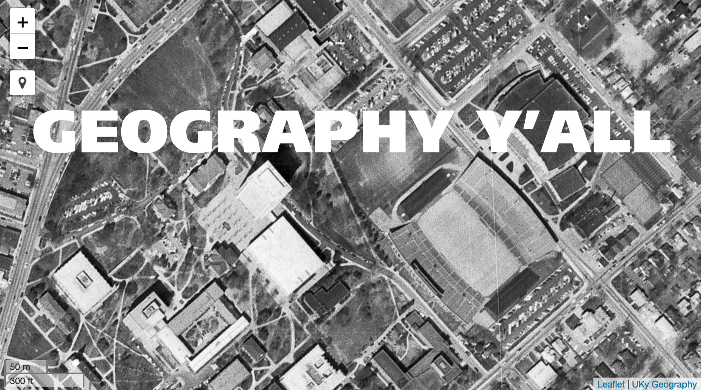
Lexington is the second largest city in Kentucky and home to the University of Kentucky. This [aerial photograph from 1971](https://uky-gis.github.io/history/maps/1971/) shows central campus, the home of UK Geography.

## Geography Department's 75th Anniversary

We are celebrating our 75th Anniversary during the 2018-2019 school year. The Department of Geography was established in 1944 and is "ranked among leading geography graduate programs in the United States." ([Wikipedia](https://en.wikipedia.org/wiki/Department_of_Geography,_University_of_Kentucky)) 

### Stories and maps

* Slide [show](history/slides) for the early years of the Department and campus
* Georeferenced [historic maps](history/maps) of campustown
* Geocache [challenge](https://gitpitch.com/boydx/geosalad/geocache_00)

## Course opportunities

The university offers numerous paths to learn mapping and GIS, from a minor for undergraduates and graduate certificate for those with a bachelor's degree. The below list isn't comprehensive but shows many of the opportunities.

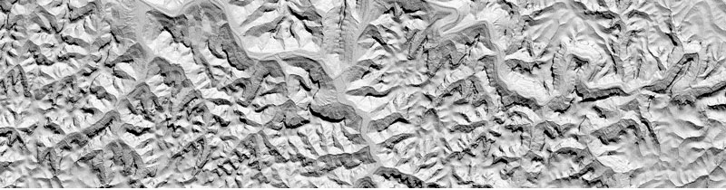   
Examples from [GEO 409](courses/geo409)

### Master of Science (MS) and Graduate Certificate in in Digital Mapping
The Department of Geography's [New Maps Plus](http://newmapsplus.uky.edu) graduate programs at the University of Kentucky offer students a challenging, intensive, digital mapping curriculum that emphasizes the acquisition of technical skills—coding, GIS, web development—while also preparing students to critically address the complexity of today’s information ecosystem.

### Mapping and GIS - Undergraduate Minor
The College of Arts & Sciences Department of Geography offers a 18 hour (6 course) minor. The following three courses are required and form the foundation of the program's curriculum:

* [GEO 109](courses/geo109) - Digital Mapping OR GEO 164 - Worlds: Global Information Geographies [3 hours]
* [GEO 309](courses/geo309) - Introduction to GIS [3 hours]
* [GEO 409](courses/geo409) - Advanced GIS [3 hours]

[Link to all available courses in minor](http://www.uky.edu/academics/minor/as/mapping-and-gis-minor)

### Mapshop

The Department of Geography's [Mapshop](http://newmaps.uky.edu/mapshop) provides an opportunity for community and campus organizations to work directly with students, faculty, and cartographic staff in the production of geographic representations. Mapshop is part of the larger University of Kentucky's [New Mappings Collaboratory](http://newmaps.uky.edu/) which is committed to innovations in mapping.

### Short courses

Occasionally we offer one-day instruction in various mapping technologies. Here is a past list of courses taught.

* [QGIS instruction](https://boydx.github.io/qgis/)

## Video on Vimeo

* <a href="https://vimeo.com/39893157">I Am a Geographer</a> from <a href="https://vimeo.com/ukartsci">UK College of Arts &amp; Sciences</a>
* <a href="https://vimeo.com/118823818">Mapping is Serious Business</a> from [New Maps Plus](http://newmapsplus.uky.edu)
* <a href="https://vimeo.com/118823650">Graduate certificate in mapping</a> from [New Maps Plus](http://newmapsplus.uky.edu)

## Examples of student work

| Preview       | Description     |
| :-------------: |:-------------:|
|  | Arches of the Red River Gorge mapped and visualized by GEO 409 Fall 2018 students. [Link](https://uky-gis.github.io/maps/rrg-arches/)   |
|  | Bluegrass region parks and adventures mapped in many ways by GEO 409 Spring 2018 students. [Link](https://tastyfreeze.github.io/bluegrass/region/)   |
|  | Lidar tree heights in specific neighborhood associations in Lexington, Kentucky to feature ecosystem services provided by urban tree canopy.  [Link](https://rvirto01.github.io/NRE355_Tree_canopy_study/)   |
|      | A web page that showcases work in mapping, photographing, and researching the Town Branch Trail and its surroundings.  [Link](https://reece2ke.github.io/geo409_site/)  |   
|  | Scenic and topographic analysis of Pilot Knob State Nature Preserve. [Link](http://sweb.uky.edu/~blshea1/nre355/pksnp/)    |   
|  |Pine Mountain canopy tour at Pine Mountain State Resort Park. [Link](http://sweb.uky.edu/~blshea1/nre355/pine-mountain-canopy-tour/)    |   
|    | Arboretum Woods tree census where 15 student teams mapped and measured trees in approx. 15 ac. [Link](http://sweb.uky.edu/~blshea1/ArboretumWoods/) |
| 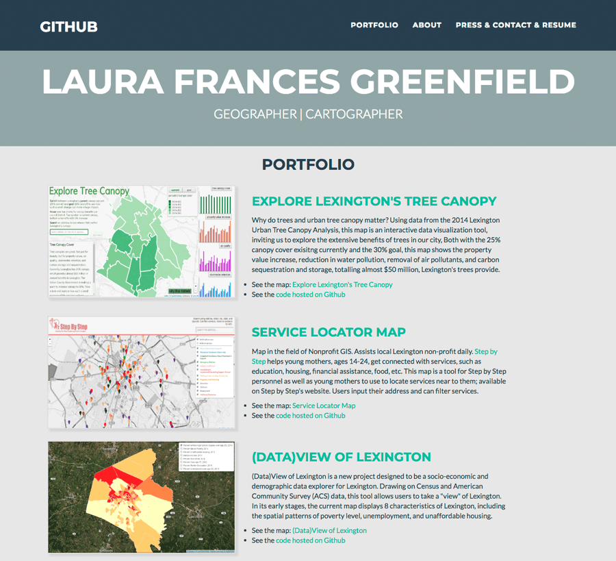   | Examples from Laura Greenfield.  [Link](http://lfgreenfield.github.io/) |
| 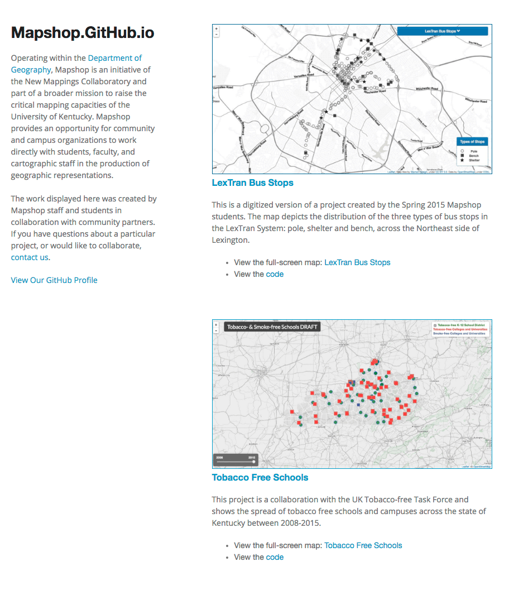   | Work displayed here was created by Mapshop staff and students in collaboration with community partners.  [Link](http://mapshop.github.io/) |
| 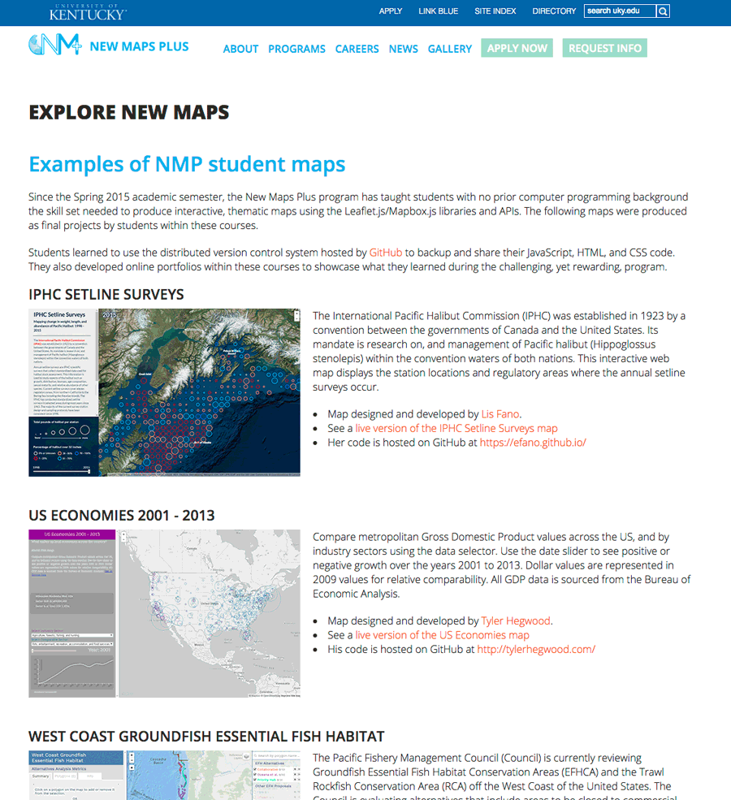   | Examples from New Maps Plus students. [Link](http://newmapsplus.uky.edu/explore-new-maps) |
| 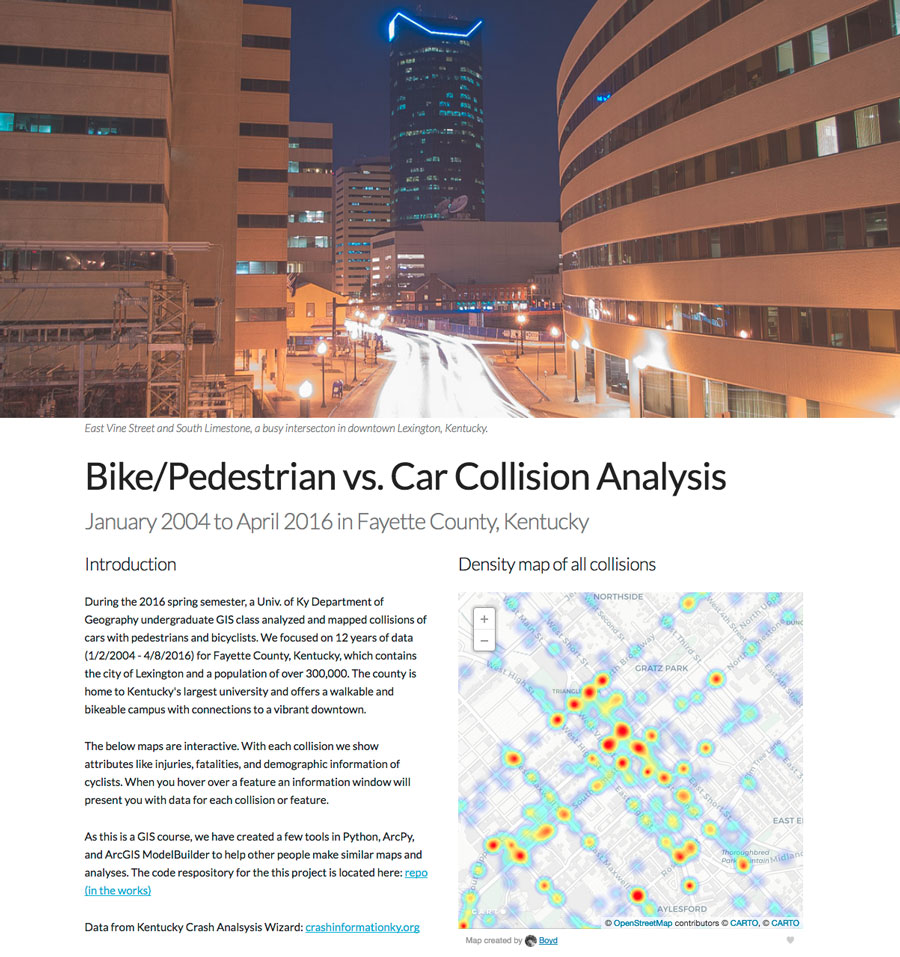   | Bike/Pedestrian vs. Car Collision Analysis [Link](https://boydx.github.io/collisions/) |
| 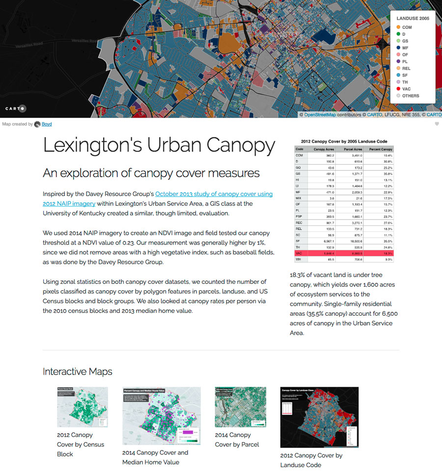   | Lexington tree canopy study: patterns of vacant property tree canopy cover [Link](http://sweb.uky.edu/~blshea1/nre355/lexington-canopy-cover/) |
| 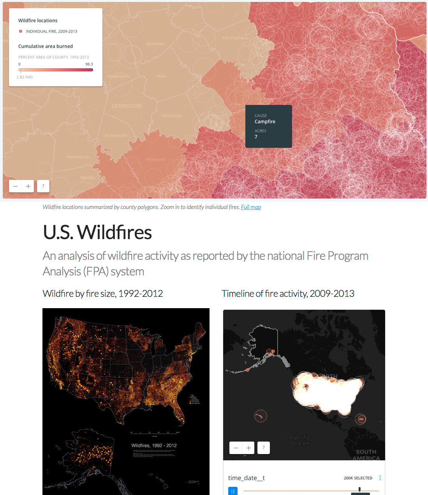   | U.S. Wildfires: An analysis of wildfire activity as reported by the national Fire Program Analysis (FPA) system [Link](http://boydx.github.io/wildfires/) |
| 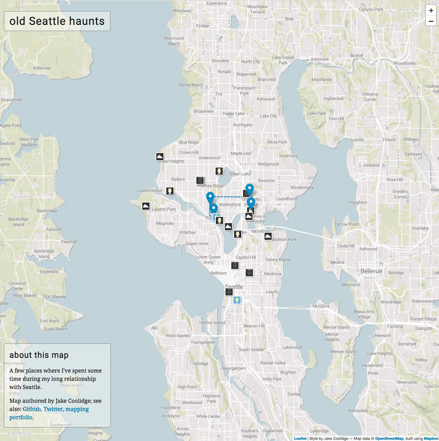   | Old Seattle Haunts [Link](https://jakec-uky.github.io/hometown-map/) |
| 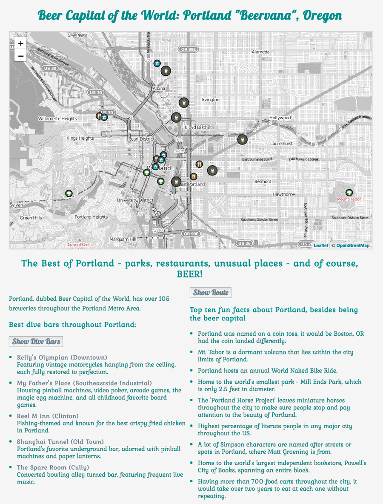   | Portland: "Beervana" Oregon [Link](https://jhannigan3.github.io/Portland-hometown-map/) |
| 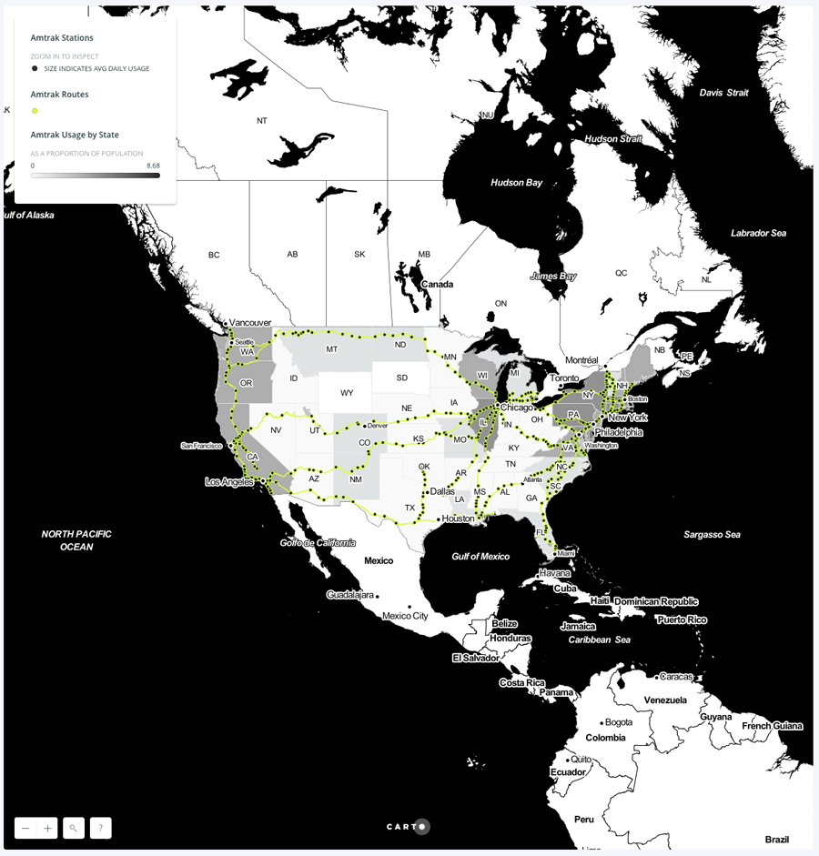   | Amtrak Usage by State [Link](https://nmp.carto.com/u/kerryg/builder/deca6676-7d91-4a90-b4c8-e566b290fa99/embed) |
| 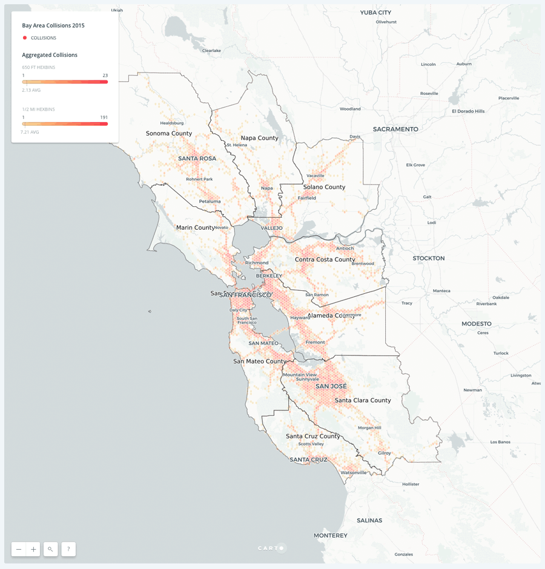   | 2015 Bay Area Car vs. Bike/Pedestrian Collisions [Link](https://nmp.carto.com/u/watkinsr/builder/3301c2a9-90c4-43a4-b11f-1cafd238df29/embed) |

## History of the Geography Department

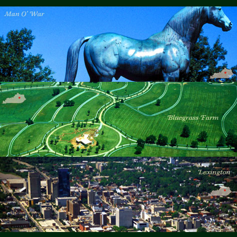   
Karl Raitz's [Photography of Kentucky](https://exploreuk.uky.edu/catalog?f[source_s][]=Karl%20Raitz%20Kentucky%20slides)

* Wikipedia [entry](https://en.wikipedia.org/wiki/Department_of_Geography,_University_of_Kentucky) and departmental home page [entry](https://geography.as.uky.edu/departmental-history)
* Other [resources](history)

