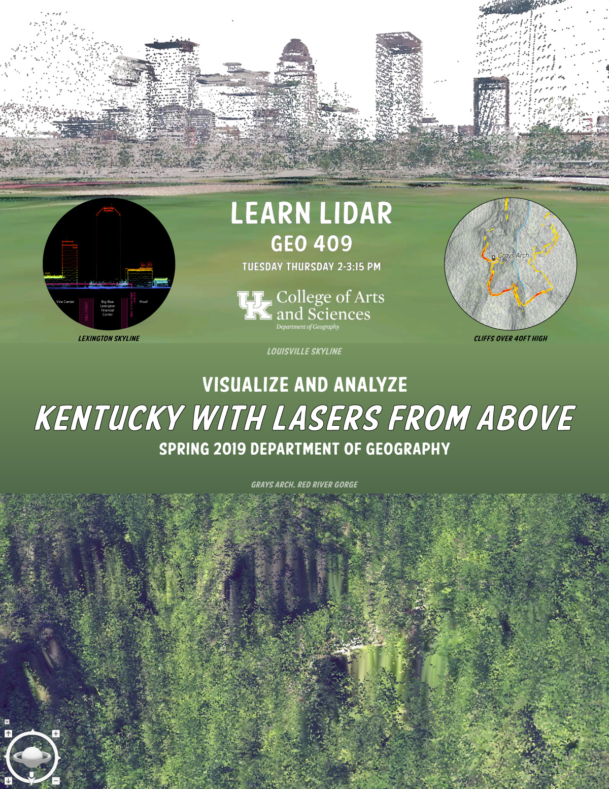
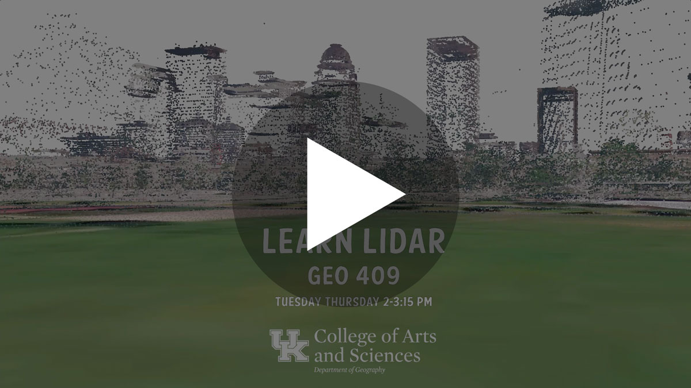
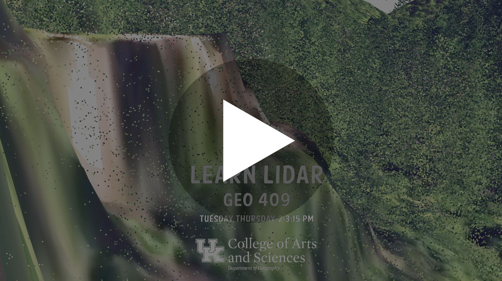
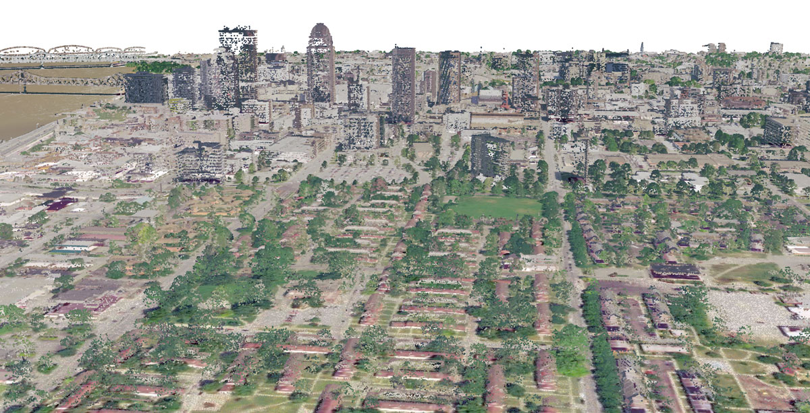
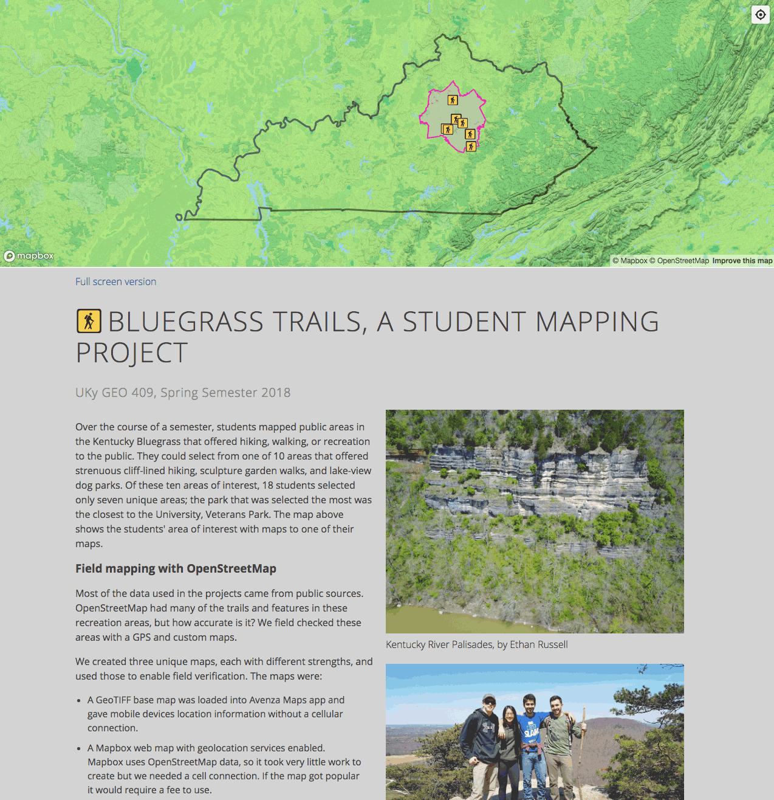

# GEO409: Advanced GIS

This course is developed to introduce intermediate and advanced topics in geographic information science and spatial analysis including theoretical and application areas. Building upon a range of GIS software systems this course covers geographic data collection, entry and editing, spatial analysis, interpolation, and map development and display.

In Spring 2019, we will explore Kentucky's lidar dataset recently made available for the entire state. The lidar data model encodes 3D position as a point in a massive point cloud. A single point can have attributes that represent an object's type like ground, vegetation, and building top. In a GIS, we render point clouds as digital surface models where we can measure and analyze features in three dimensions.

   
Enroll in Geo 409 for the Spring 2019 semester!

## Videos
  
Louisville's skyline rendered in 3d point cloud

  
Grays Arch, Red River Gorge rendered in 3d point cloud

  
Illumination of bare-earth digital elevation model of Red River Gorge to approximate cliff face daily insolation rates

    
Go Big Blue Nation!

## Presentation

[Data and art: what we do in 409](https://gitpitch.com/boydx/geosalad/uky-gis)

## Example of past class projects

    
Bluegrass Trails - [link](https://tastyfreeze.github.io/bluegrass/region/)

    
Town Branch Trail - [link](https://reece2ke.github.io/geo409_site/)