# Typical workflow in GEO409, Fall 2018

We have introduced a lor of tools this semester and sometimes it's a little confusing to figure which program to use and at what point in the workflow. Let's suggest a typical step by step workflow in the lab.

## Fetch and pull any changes from remote repo

You've cloned the lesson repo from GitHub.com and placed it in your root GIS folder on the `C:` drive, e.g., `C:\BoydsGIS` folder. **If you work outside of the lab** you should first open GitHub Desktop and fetch and pull all remote changes. This help you continue working seamlessly. 

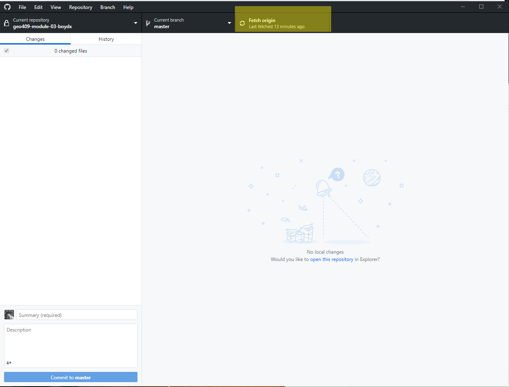    
Fetch and pull any changes from remote repo

## Get data from Canvas

Make sure you download data for the week from Canvas!

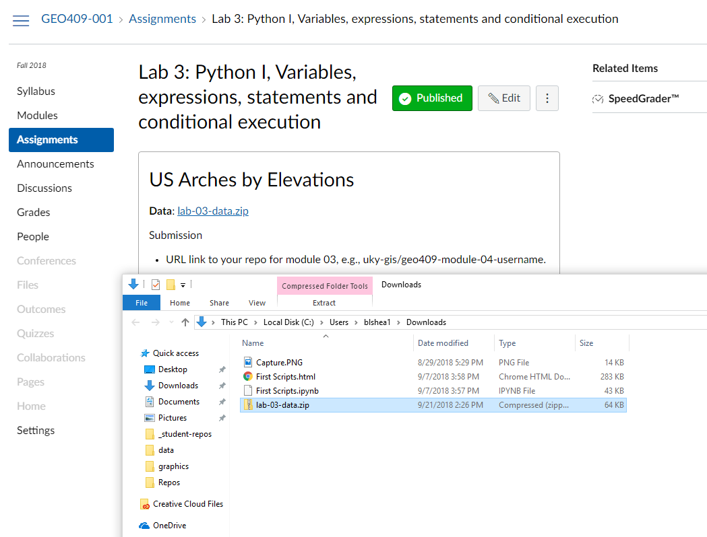   
Get data from Canvas

### Extract data to your downloaded data folder!

Make sure you extract your downloaded data for the week from Canvas!

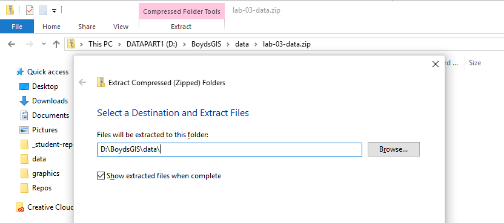   
Extract data to your downloaded data folder!

### File Geodatabase extracted

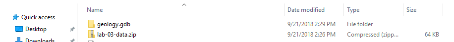   
There's the geodatabase!

## Open Python Command Prompt

We need to get into the root GIS directory before we launch Jupyter Notebook. In the Windows Start menu find **ArcGIS > Python Command Prompt** and launch it.

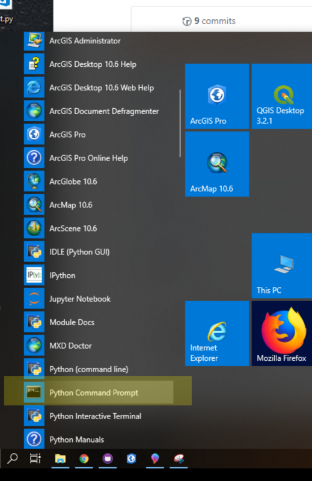   
Open Python Command Prompt (not the Command Line)

## Execute a prompt command to change directories

If your root GIS folder is at `C:\BoydsGIS` the execute the following line at the prompt:

```bat
cd c:\BoydsGIS
```
This says, "change directory to c: drive and into the folder BoydsGIS." You of course need to change "BoydsGIS" to the appropriate name. Execute the following command and you should the lesson repository:

```bat
dir
```

You should see something to below except my GIS space is on the `D:` drive here.

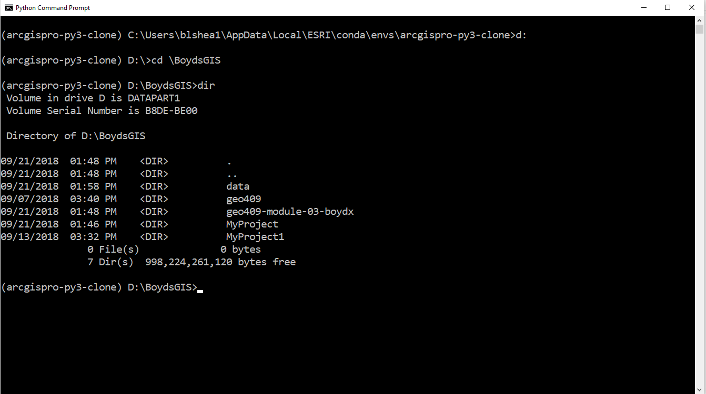   
Execute a prompt command to change directories

## Jupyter Notebook

Once we are in our GIS space we can launch Jupyter Notebook. At the command prompt, execute:

```bat
jupyter notebook
```

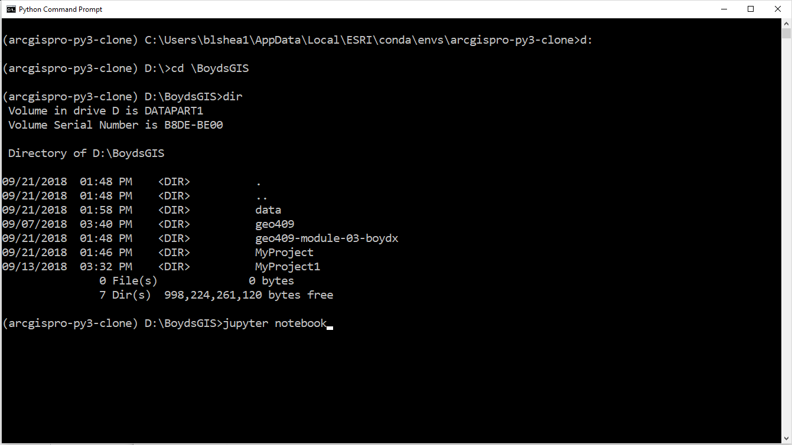   
Launch Jupyter Notebook

This will open a browser that you can drill down to the necessary directory. There's the lesson! Click to enter.

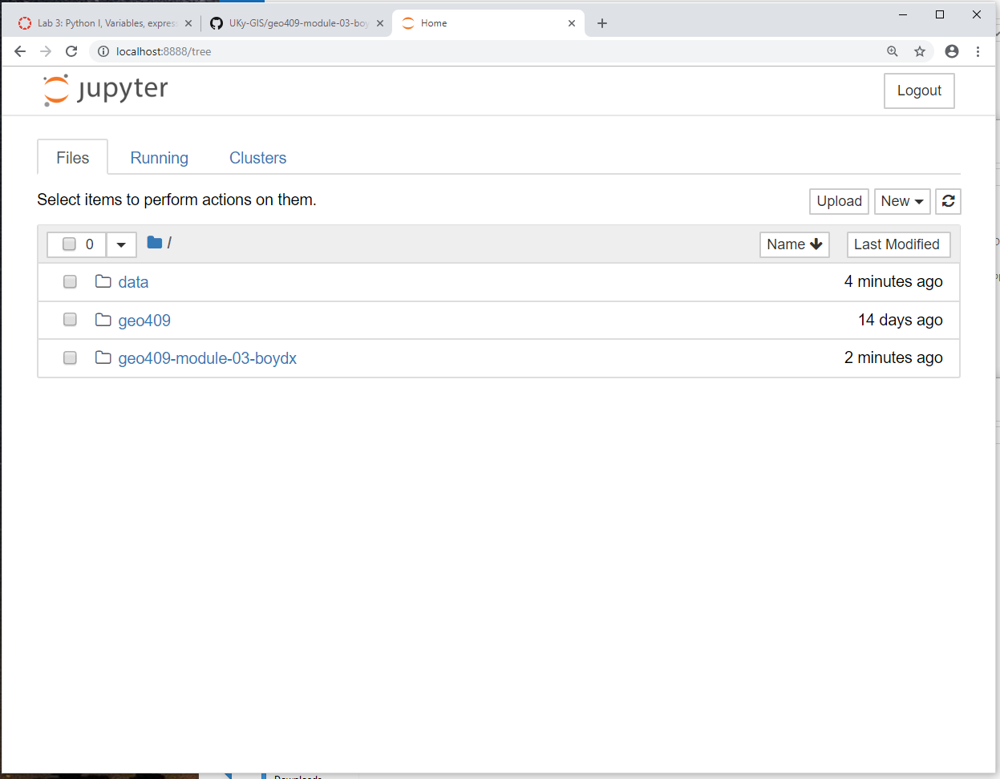   
Jupyter displays contents of the root GIS folder

You should find a file with the extension `.ipynb` which contains our sample code. Click on it!

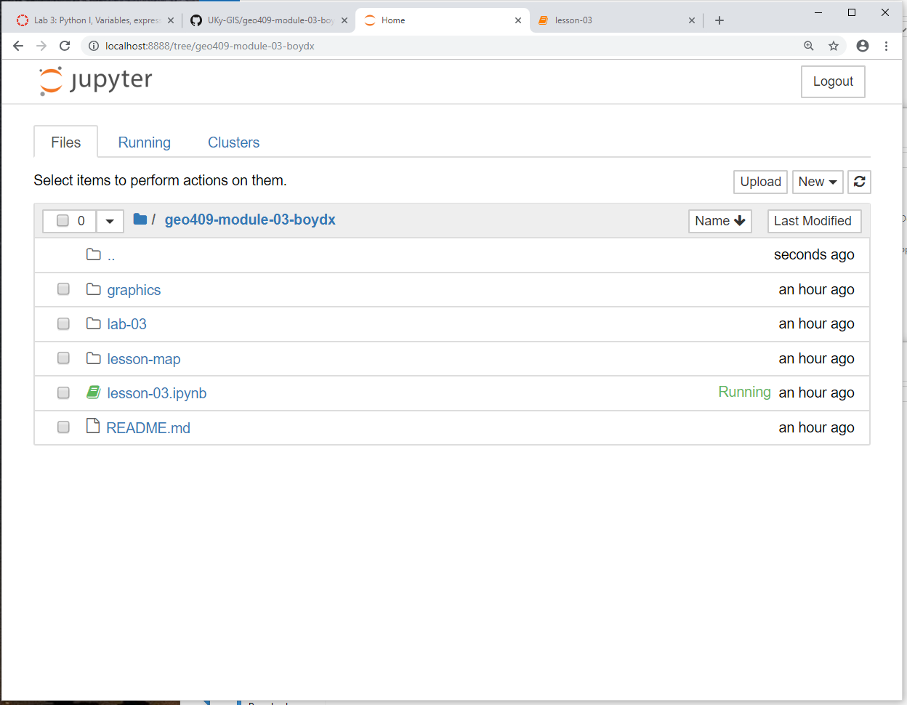   
Click on lesson notebook

Find a cell with Python. You can tell which ones are code because it has code syntax.

```python
# I'm a comment in Python.
# Comments don't execute!

print("I am inside a print function and will print to the screen")
```

After you run the cell, you'll see a number in square brakets on the left `[]` with a number inside. That tells you the cell's order of execution compared to other cells. 

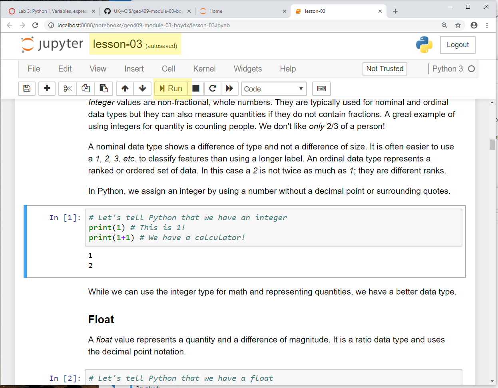   
Make changes in cell and Run. Jupyter autosaves!

Work your way through the lesson and experiment!

### Something will go wrong!

When the browser hangs or if you see an `[*]` to the left of a code cell, you might be crashes. Open the *Kernel* dropdown. 

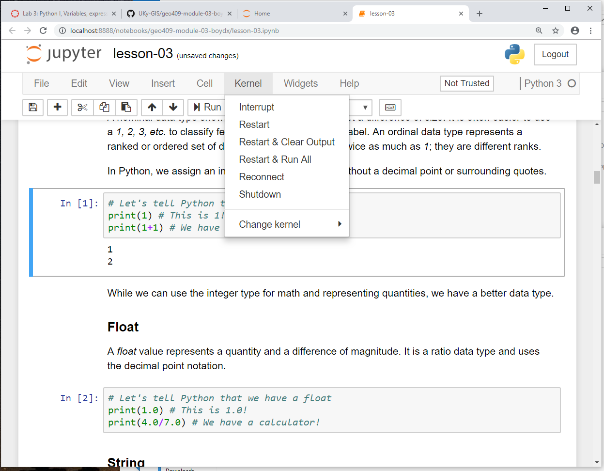   
Kernal dropdown

The *Interrupt* will stop a cell that's taking too long to execute. *Restart & Clear Output* will clear all imported modules and assigned variables. You will need to step through and run each cell from the beginning. *Restart & Run All* will step through and execute all cells in the proper sequence. This will test whether your script will run properly from the command prompt or from an ArcGIS tool.

### Create a new notebook for ArcGIS

Go back to the home tab in your browser. Click on the *New > Python 3* notebook.

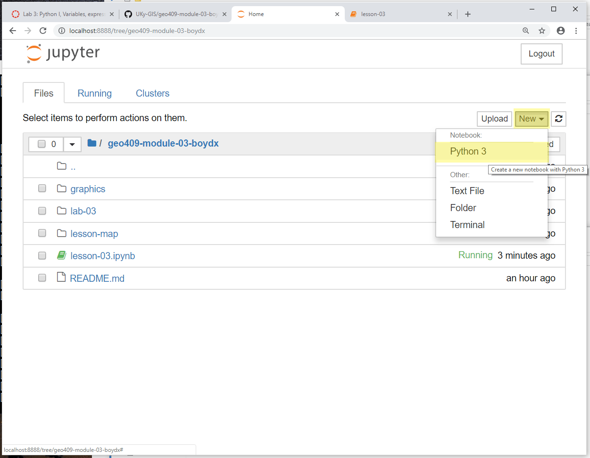   
Kernel dropdown

Let's change the name of the notebook to something appropriate. This will automatically save to your lesson folder.

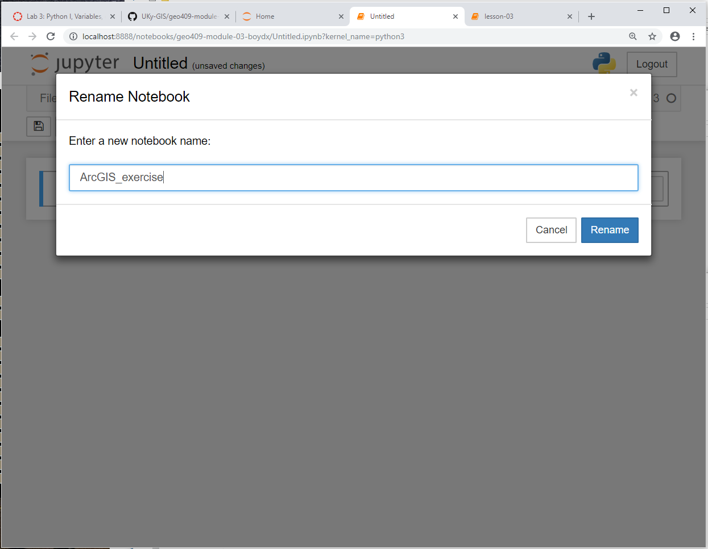   
Change the name of the notebook

For ArcPy scripts, we want to add just one statement in the first cell.

```python
import arcpy
```

The site pack

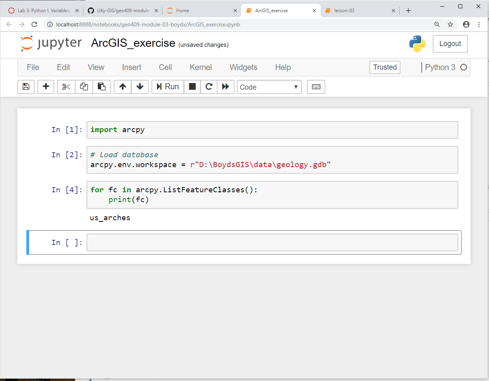   
Add some ArcPy and execute
