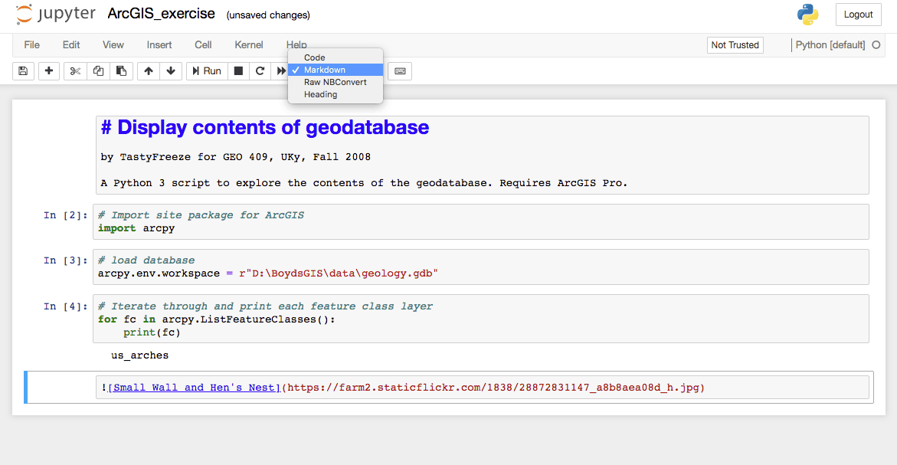
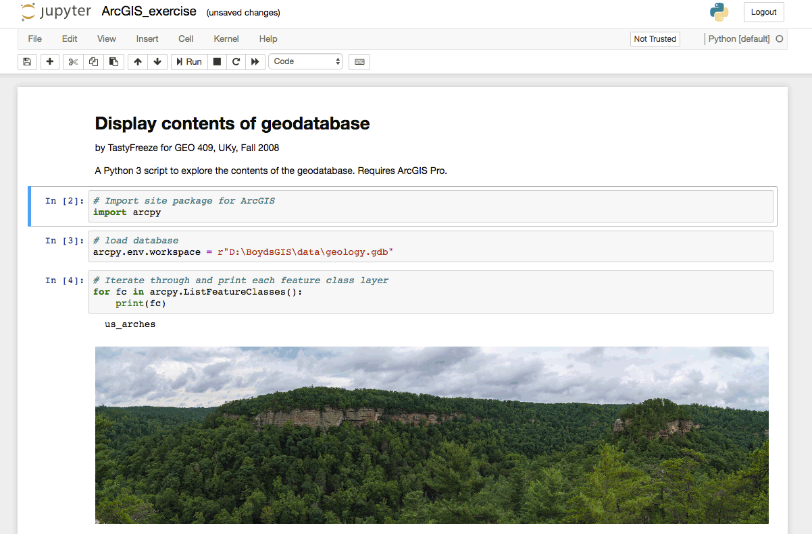
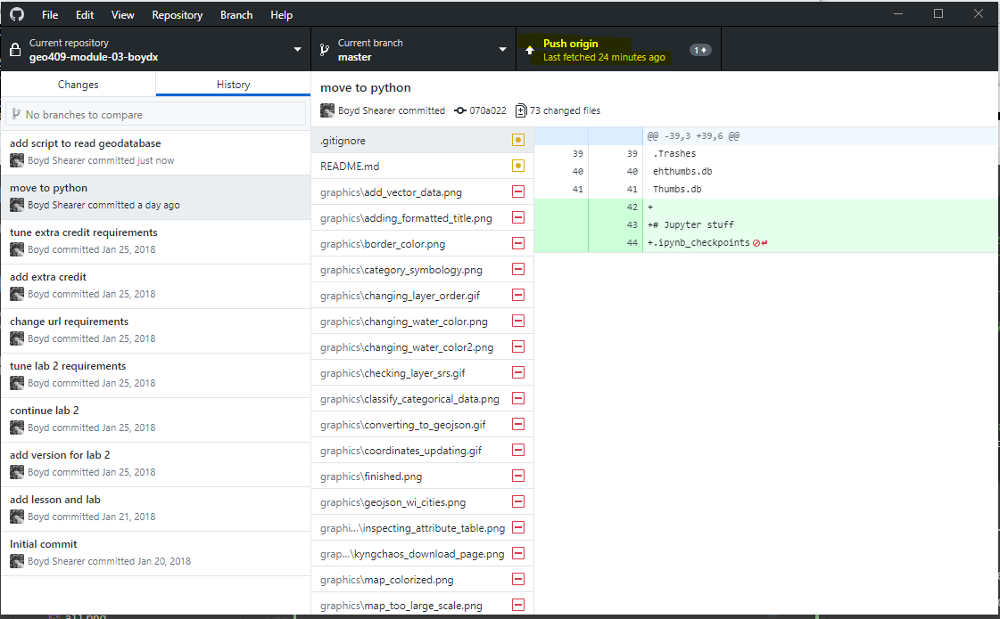
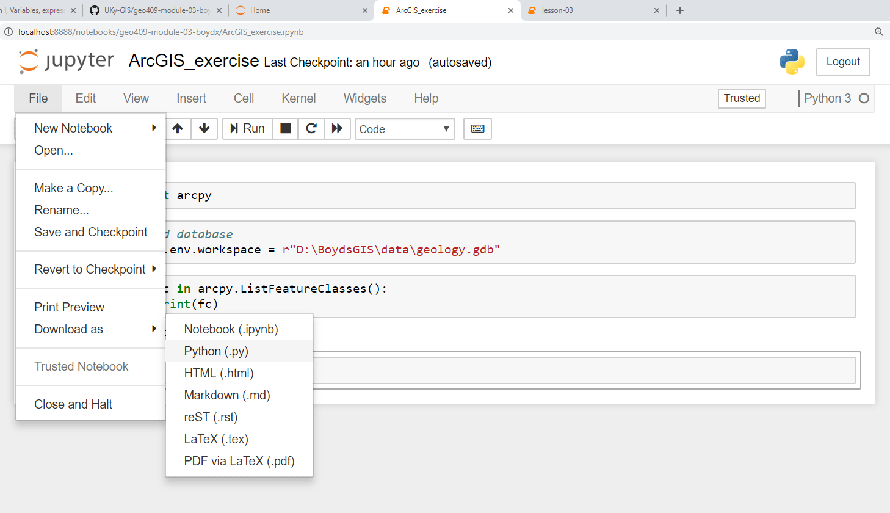
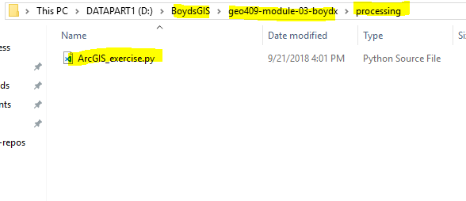
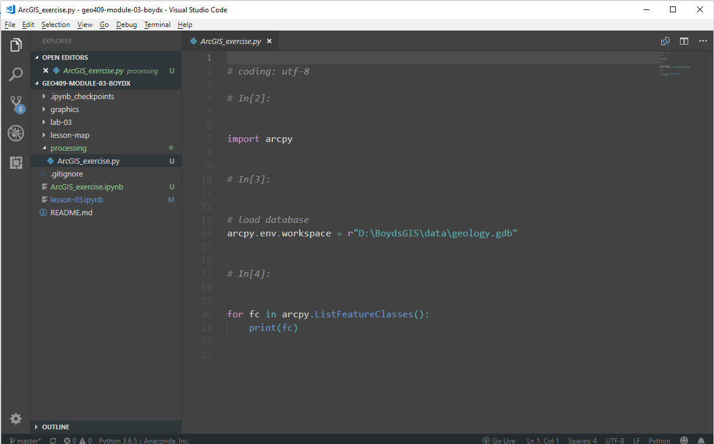

# Typical workflow in GEO409, Fall 2018

We have introduced a lot of tools this semester and sometimes it's a little confusing to figure which program to use and at what point in the workflow. Between GitHub Desktop, VS Code, Jupyter Notebook, and, finally, ArcGIS Pro, let's suggest a typical step-by-step workflow in the lab.

## Fetch and pull any changes from remote repo

You've cloned the lesson repo from GitHub.com and placed it in your root GIS folder on the `C:` drive, e.g., `C:\BoydsGIS` folder. **If you work outside of the lab** you should first open GitHub Desktop and fetch and pull all remote changes. This will help you to continue working seamlessly. 

    
Fetch and pull any changes from remote repo

## Get data from Canvas

Make sure you download data for the week from Canvas!

   
Get data from Canvas

### Extract data to your downloaded data folder!

Make sure you extract your downloaded data for the week from Canvas!

   
Extract data to your downloaded data folder!

### File Geodatabase extracted

   
There's the geodatabase!

## Open Python Command Prompt

We need to get into the root GIS directory before we launch Jupyter Notebook. In the Windows Start menu find **ArcGIS > Python Command Prompt** and launch it.

   
Open Python Command Prompt (not the Command Line)

## Execute a prompt command to change directories

If your root GIS folder is at `C:\BoydsGIS` the execute the following line at the prompt:

```bat
cd c:\BoydsGIS
```
This says, "change directory to c: drive and into the folder BoydsGIS." You of course need to change "BoydsGIS" to the appropriate name. Execute the following command and you should the lesson repository:

```bat
dir
```

You should see something to below except my GIS space is on the `D:` drive here.

   
Execute a prompt command to change directories

## Jupyter Notebook

Once we are in our GIS space we can launch Jupyter Notebook. We discovered that you don't need to run ArcGIS Pro before or during a Jupyter Notebook session. At the command prompt, execute:

```bat
jupyter notebook
```

   
Launch Jupyter Notebook

This will open a browser that you can drill down to the necessary directory. There's the lesson! Click to enter.

   
Jupyter displays contents of the root GIS folder

You should find a file with the extension `.ipynb` which contains our sample code. Click on it!

   
Click on lesson notebook

Find a cell with Python. You can tell which ones are code because it has code syntax.

```python
# I'm a comment in Python.
# Comments don't execute!

print("I am inside a print function and will print to the screen")
```

After you run the cell, you'll see a number in square brakets on the left `[]` with a number inside. That tells you the cell's order of execution compared to other cells. This order is important because code is a sequence of statements that run from top to bottom, line by line. If we import modules and assign variables, those need to be loaded before the cells below run.

   
Make changes in cell and Run. Jupyter autosaves!

Work your way through the lesson and experiment! If you close the browser you might need to relaunch Jupyter Notebook in the terminal.

### Something will go wrong!

When the browser hangs or if you see an `[*]` to the left of a code cell, you might be crashes. Open the *Kernel* dropdown. 

   
Kernal dropdown

The *Interrupt* will stop a cell that's taking too long to execute. *Restart & Clear Output* will clear all imported modules and assigned variables. You will need to step through and run each cell from the beginning. *Restart & Run All* will step through and execute all cells in the proper sequence. This will test whether your script will run properly from the command prompt or from an ArcGIS tool.

### Create a new notebook for ArcGIS

Go back to the home tab in your browser. Click on the *New > Python 3* notebook.

   
Kernel dropdown

Let's change the name of the notebook to something appropriate. This will automatically save to your lesson folder.

   
Change the name of the notebook

For ArcPy scripts, we want to add just one statement in the first cell.

```python
import arcpy
```

The site package is pretty heavy and takes a few seconds to import. Having it in its own cell allows us to run it once and keep it loaded for other cells.

   
Add some ArcPy and execute

### Add documentation to your Notebook

Before you finish your assignment, add some documentation that tells people what you've made, what it does, and what is required. Add a new cell, move it to the top, convert it to a **Markdown** formatted cell, and some Markdown content.

   
Add Markdown content describing your project

There really is no limit as to what you can add. Notice the bottom cell is a Markdown image. When we run that cell, presto! We can see a render image of the area that inspires us to write more code!

   
Run Markdown cell to render content

When you add this to GitHub,com this Markdown will render for the visitor. You can make stylish notebooks.

### Shutting down for the day

If you are finished for the day, click **Logout** in all of the Jupyter browser windows. At the Python Command Prompt, press the key combination `crtl-c` (Control + c) to close the window. It should say, "Kernel shutdown...". 

To access the notebook again, restart the Python Command Prompt, change directories to your root GIS space, drill down to the desired notebook, and rerun the cells from top to bottom.

## Commit and push to GitHub.com!

Save everything, open GitHub Desktop, and commit your changes with a good message. Click on the **Push** button.

   
Commit and push changes when finished for the day

After you push and you see no active changes then you are synced and can access your content outside of the lab.

### Saving a final .py file (optional)

If you want to create a final Python file (.py) for submission or sharing, you need to **Download** as a Python file. **Note this step is only required** if you need to share your program with folks that don't use the Jupyter Notebook.

   
Save as .py file

The file will likely land in your `Downloads` folder. If so, move it to a folder called *processing* in your lesson's repo. 

   
Python file in your processing folder

### Editing in VS Code

Open your lesson repository in VS Code if you want to polish the export for general consumption. The export isn't formatted particularly well. 

   
Edit the file in VS Code

There is no agreement what should be in the header of a Python file, but generally you can some info about the subject and author. If you make your work public, you'll need to consider a license for your work.

```python
# Python 3
# coding: utf-8

# ----- Display contents of geodatabase ----- #
# by TastyFreeze for GEO 409, UKy
# Fall, 2018
# ----- ------------------------ ----- #

# Import site package for ArcGIS
import arcpy

# load database
arcpy.env.workspace = r"D:\BoydsGIS\data\geology.gdb"

# Iterate through and print each feature class layer
for fc in arcpy.ListFeatureClasses():
    print(fc)
```


